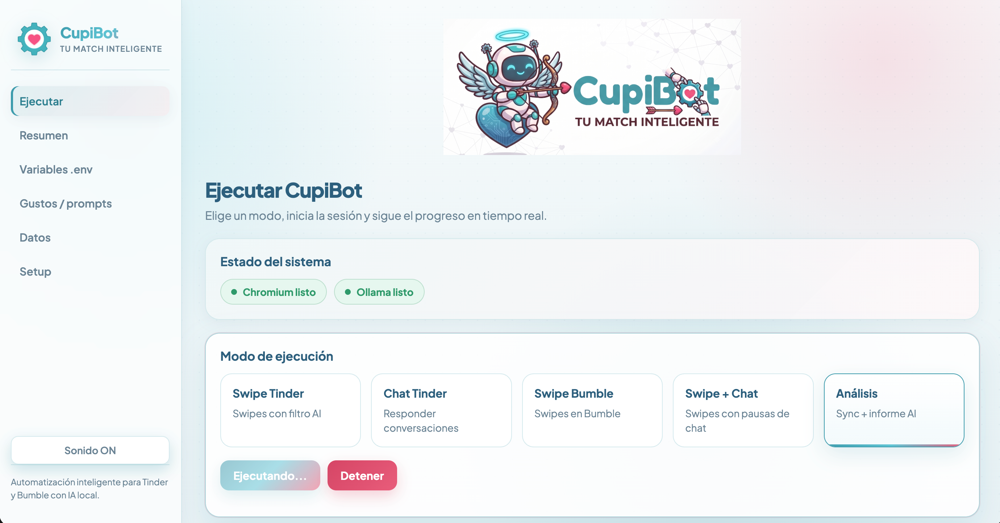
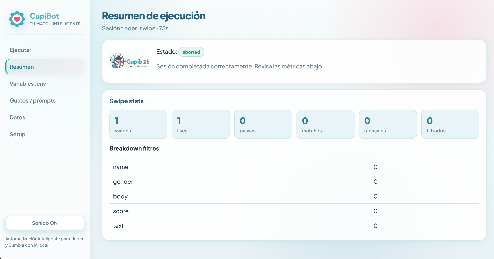
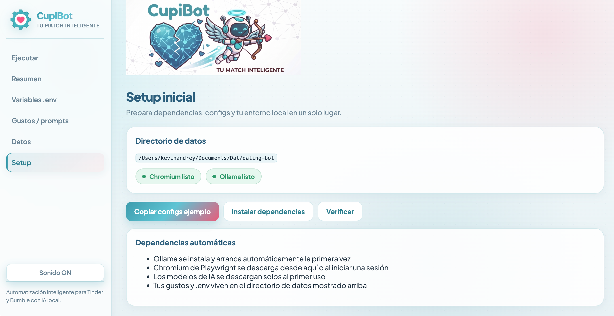

# CupiBot

<p align="center">
  
</p>

<p align="center">
  <strong>Automatización inteligente para Tinder y Bumble con IA local.</strong><br />
  Filtra perfiles con visión artificial, responde conversaciones y genera informes - todo desde tu computadora, sin enviar datos a la nube.
</p>

<p align="center">
  Si CupiBot te resulta útil, <a href="https://github.com/KevinAndrey96/cupibot">deja una estrella en GitHub</a> - no cuesta nada y ayuda a que más gente lo descubra.
</p>

---

## ¿Qué es CupiBot?

CupiBot es una aplicación de escritorio que te ayuda a:

- **Swipear con criterio** - la IA analiza fotos y perfil antes de dar like o pass.
- **Chatear por ti** - responde matches con un tono personalizado según tus prompts.
- **Combinar ambos** - swipes con pausas automáticas para atender conversaciones.
- **Analizar tu historial** - sincroniza chats y genera un informe con recomendaciones.

Todo corre en local: **Ollama** para los modelos de IA y **Chromium** para el navegador. La primera vez CupiBot los instala y configura por ti.

---

## Vista previa

### Ejecutar una sesión

Elige un modo, revisa que Chromium y Ollama estén listos, y pulsa **Iniciar**. Los logs aparecen en tiempo real mientras corre la sesión.

<p align="center">
  
</p>

### Resumen al terminar

Al finalizar (o detener) una sesión, ves métricas claras: swipes, likes, passes, matches, mensajes enviados y desglose de filtros aplicados.

<p align="center">
  
</p>

### Setup inicial

Desde **Setup** preparas todo en un solo lugar: copiar configs de ejemplo, instalar dependencias y verificar que el entorno esté listo.

<p align="center">
  
</p>

---

## Descargar e instalar

### Requisitos

- **macOS** o **Windows** (la app de escritorio es la forma recomendada de usar CupiBot)
- Cuenta activa en **Tinder** y/o **Bumble**
- Conexión a internet la primera vez (para descargar modelos y Chromium)

No necesitas instalar Ollama manualmente: CupiBot lo gestiona automáticamente.

### Opción A - Instalador (recomendado)

1. Ve a [**Releases**](https://github.com/KevinAndrey96/cupibot/releases) del repositorio.
2. Descarga el instalador de la última versión para **macOS** (`.dmg`) o **Windows** (`.exe`).
3. Instala y abre CupiBot.

#### macOS: "CupiBot is damaged and can't be opened"

Eso **no significa que el archivo esté corrupto**. macOS bloquea apps descargadas de internet que aún no tienen certificado de Apple Developer. Prueba en este orden:

**Opción 1 — Clic derecho**
1. Arrastra CupiBot a Aplicaciones desde el `.dmg`.
2. Clic derecho en **CupiBot** → **Abrir** → **Abrir** (no uses doble clic la primera vez).

**Opción 2 — Terminal** (quita la cuarentena de macOS)

```bash
xattr -cr /Applications/CupiBot.app
```

Si aún no lo moviste a Aplicaciones, usa la ruta donde esté el `.app` (por ejemplo en el volumen del `.dmg`).

> En el futuro, con certificado de Apple Developer, este paso no hará falta. Por ahora es normal en apps open source distribuidas por GitHub.

> También puedes descargar builds recientes desde la pestaña [**Actions**](https://github.com/KevinAndrey96/cupibot/actions) (artefactos `cupibot-mac` / `cupibot-win`), pero Releases es la forma más cómoda para usuarios finales.

### Opción B - Desde el código fuente

Si prefieres ejecutarlo en desarrollo o contribuir al proyecto:

```bash
git clone https://github.com/KevinAndrey96/cupibot.git
cd cupibot
npm run install:local
npm run desktop:dev
```

`install:local` instala dependencias de Node, prepara Chromium para Playwright y crea tus archivos de configuración locales a partir de los ejemplos.

---

## Primeros pasos

Sigue este orden la primera vez que abras CupiBot:

### 1. Setup

En la pestaña **Setup**:

1. **Copiar configs ejemplo** - genera tus archivos `.json` de gustos y prompts (solo si aún no existen; no sobrescribe lo que ya personalizaste).
2. **Instalar dependencias** - asegura que Ollama y el resto del entorno estén listos.
3. **Verificar** - confirma que Chromium y Ollama respondan correctamente.

Verás el directorio de datos de la app en esa misma pantalla. Ahí viven tu `.env`, configs, conversaciones y sesión del navegador.

### 2. Iniciar sesión en Tinder / Bumble

1. Ve a **Variables .env** y deja `HEADLESS=false` para ver el navegador (recomendado al principio).
2. En **Ejecutar**, elige un modo de swipe o chat e inicia la sesión.
3. Cuando se abra Chromium, **inicia sesión manualmente** en Tinder o Bumble.
4. La sesión queda guardada para los siguientes arranques - no tendrás que loguearte cada vez.

### 3. Personaliza tus gustos

Antes de una sesión larga de swipes, revisa **Gustos / prompts** o edita los archivos en `config/ai/`:

| Archivo | Para qué sirve |
|---------|----------------|
| `beauty-filter.json` | Tus preferencias visuales (scoring de fotos) |
| `gender-filter.json` | Filtros de género y tipo de cuerpo |
| `excluded-names.json` | Nombres a rechazar automáticamente |
| `espanol/chat.json` | Persona, tono, Instagram y reglas de conversación |
| `espanol/openers.json` | Mensajes de apertura al hacer match |
| `espanol/personal-context.json` | Respuestas sobre ti (edad, ciudad, trabajo, hobbies…) |
| `espanol/analysis.json` | Prompt del informe de análisis |

Los archivos `.json` reales **no se suben al repositorio** - son privados y solo existen en tu máquina. En el repo hay plantillas `.example.json`.

---

## Modos de ejecución

| Modo | Qué hace | Cuándo usarlo |
|------|----------|---------------|
| **Swipe Tinder** | Swipes con filtro de IA en Tinder | Sesiones de like/pass automatizadas |
| **Chat Tinder** | Responde conversaciones existentes | Cuando ya tienes matches y quieres mantener chats activos |
| **Swipe Bumble** | Swipes con filtro de IA en Bumble | Igual que Tinder, en Bumble |
| **Swipe + Chat** | Swipes con pausas periódicas para chatear | Combinar prospección y conversación en una sola sesión |
| **Análisis** | Sincroniza chats y genera informe con IA | Revisar patrones, mejorar prompts o ver el estado de tus conversaciones |

### Swipe + Chat

En este modo, cada cierto número de swipes (configurable en `.env` con `CHAT_BREAK_INTERVAL`) CupiBot pausa el swipe para revisar y responder conversaciones, y luego retoma.

### Análisis

Exporta el historial de conversaciones y genera un informe basado en tus prompts de análisis. Útil para afinar tu estrategia sin revisar chat por chat.

---

## Configuración

Puedes editar todo desde la app o directamente en archivos. La app valida los cambios antes de guardar.

### Variables de entorno (`.env`)

Accesibles en **Variables .env**. Las más importantes para empezar:

| Variable | Descripción | Valor por defecto |
|----------|-------------|-------------------|
| `HEADLESS` | `false` = ves el navegador (útil para login) | `false` |
| `SWIPE_MODEL` | Modelo de visión para filtrar perfiles | `llava:7b` |
| `CHAT_MODEL` | Modelo de texto para conversación | `qwen2.5:7b` |
| `BEAUTY_MIN_SCORE` | Score mínimo (1–10) para dar like | `8` |
| `CHAT_DRY_RUN` | `true` = genera mensajes sin enviarlos (pruebas) | `false` |
| `SEND_OPENER_ON_MATCH_TINDER` | Enviar opener automático al hacer match | `true` |

El archivo `.env.example` documenta todas las variables: tiempos entre swipes, tamaño de lotes, pausas de descanso, timeouts de análisis, etc.

### Modelos de IA

Ollama descarga los modelos automáticamente la primera vez que los necesitas. No hace falta ejecutar `ollama pull` manualmente.

- **Swipe** - modelo de visión (`llava:7b` recomendado).
- **Chat** - modelo de texto (`qwen2.5:7b` recomendado; alternativa: `llama3.1:8b`).

### Datos generados al usar CupiBot

Estos archivos se crean mientras usas la app y **permanecen en tu equipo**:

| Ubicación | Contenido |
|-----------|-----------|
| `context/historical.json` | Historial de conversaciones |
| `context/instagrams.json` | Instagrams recolectados |
| `context/unmatches.json` | Registro de unmatches |
| `context/runtime-context.json` | Preguntas nuevas respondidas en runtime |
| `user-data/` | Sesión del navegador (cookies, login) |

Consúltalos desde la pestaña **Datos** en la app.

---

## Guía de la interfaz

| Sección | Función |
|---------|---------|
| **Ejecutar** | Elegir modo, iniciar/detener, logs en vivo y progreso |
| **Resumen** | Métricas de la última sesión (swipe, chat o análisis) |
| **Variables .env** | Editar y validar variables de entorno |
| **Gustos / prompts** | Editar JSON de filtros, persona, openers y contexto |
| **Datos** | Ver conversaciones, instagrams, unmatches, preguntas pendientes e informe |
| **Setup** | Copiar configs, instalar dependencias, verificar entorno |

También puedes activar o desactivar **sonidos** desde el menú lateral.

---

## Consejos útiles

- **Prueba sin riesgo** - activa `CHAT_DRY_RUN=true` para ver qué mensajes generaría la IA sin enviarlos.
- **Login visible** - mantén `HEADLESS=false` hasta confirmar que la sesión del navegador funciona bien.
- **Filtros de visión en inglés** - los prompts de `beauty-filter` y `gender-filter` están en inglés porque el modelo de visión responde mejor así; el chat usa el idioma de `AI_LANGUAGE` (por defecto `espanol`).
- **Detener en cualquier momento** - el botón **Detener** cancela la sesión y cierra Chromium.
- **Primera sesión lenta** - es normal: se descargan modelos y Chromium si aún no están en tu máquina.

---

## Uso por terminal (CLI)

Si prefieres la línea de comandos en lugar de la app gráfica:

```bash
npm run setup      # copiar configs ejemplo
npm start          # menú interactivo en terminal
```

Los modos disponibles en CLI son equivalentes a los de la app de escritorio.

---

## Para desarrolladores

<details>
<summary>Estructura del proyecto y comandos de desarrollo</summary>

```
desktop/            → App Electron (main, preload, renderer React)
src/                → Código del bot (swipe, chat, análisis, IA)
config/ai/          → Filtros y prompts (privados; ver .example.json)
context/            → Datos de runtime (privados)
user-data/          → Sesión del navegador (privado)
```

```bash
npm run typecheck          # Verificar tipos (core)
npm run typecheck:desktop  # Verificar tipos (desktop)
npm test                   # Tests unitarios
npm run test:coverage      # Cobertura
npm run build              # Compilar core a dist/
npm run desktop:build      # Build de la app Electron
npm run desktop:dist       # Generar instalador Mac/Windows en release/
```

</details>

---

## Uso responsable

CupiBot automatiza interacciones en Tinder y Bumble. **Úsalo bajo tu propia responsabilidad.**

- Las apps de citas pueden prohibir o limitar la automatización en sus términos de servicio.
- Existe riesgo de restricciones o baneo de cuenta.
- Revisa y respeta las políticas de cada plataforma antes de usarlo.

El software se ofrece sin garantía de ningún tipo.

---

## Licencia y comunidad

CupiBot es **gratis** y de código abierto bajo licencia **[GNU AGPL v3](LICENSE)**.

Puedes usarlo, estudiarlo y contribuir al proyecto. Si modificas el código y lo distribuyes, o lo ofreces como servicio en red- debes publicar esos cambios bajo la misma licencia. Consulta el archivo `LICENSE` para el texto completo.

Si te ha sido útil, **[deja una estrella en el repositorio](https://github.com/KevinAndrey96/cupibot)** - es la forma más sencilla de apoyar el proyecto.

**[github.com/KevinAndrey96/cupibot](https://github.com/KevinAndrey96/cupibot)**
